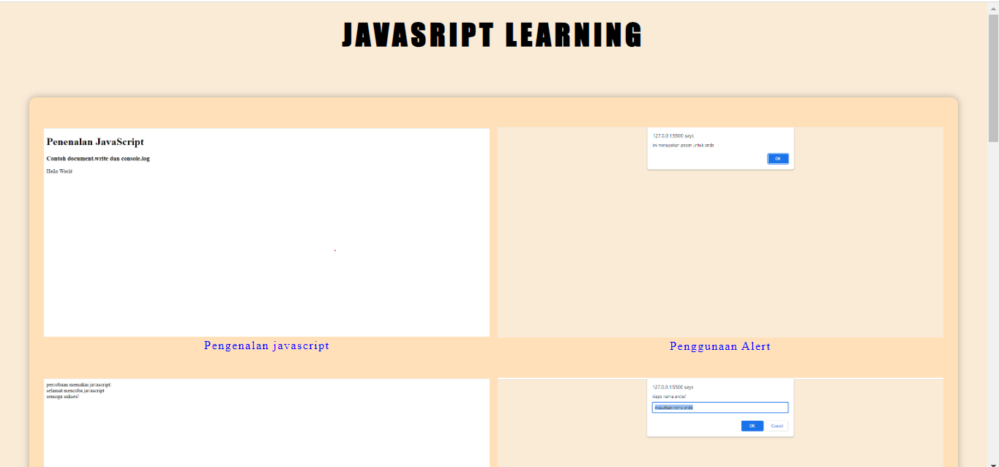
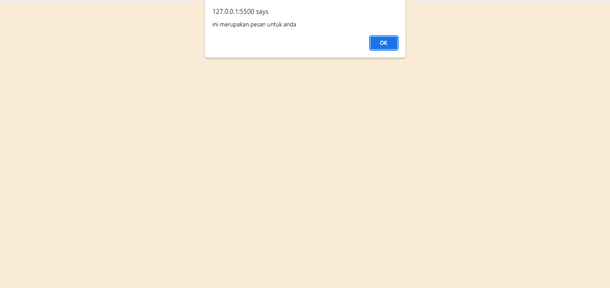
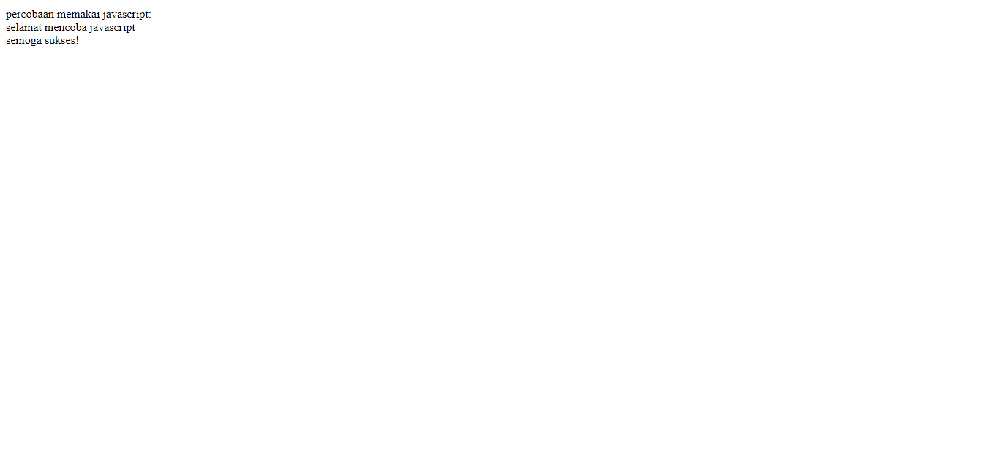
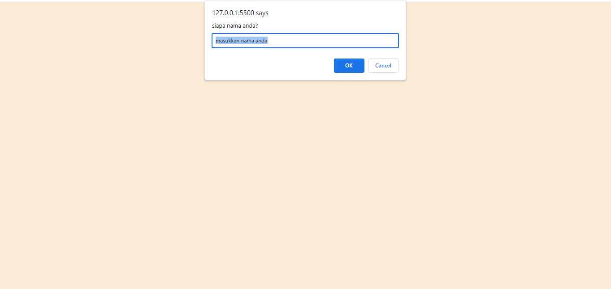
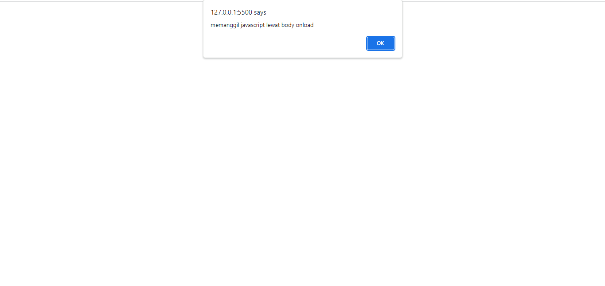
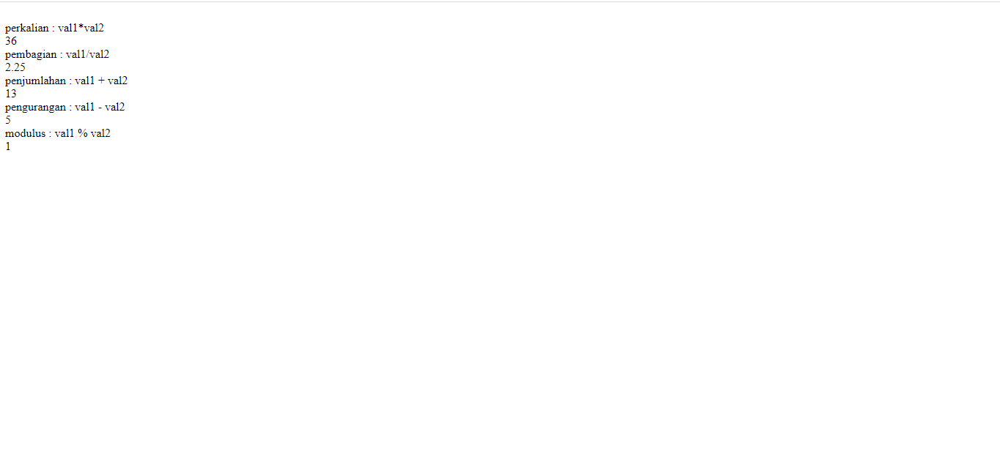
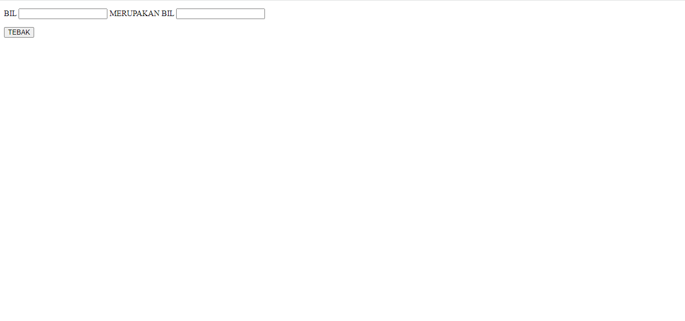
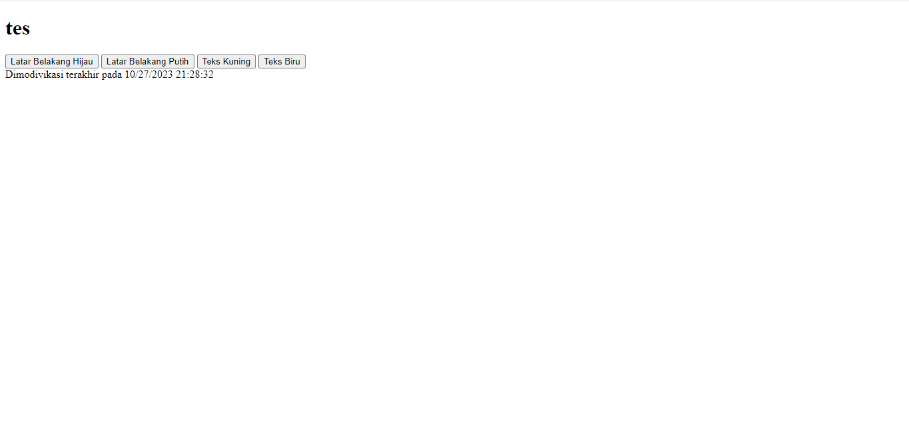
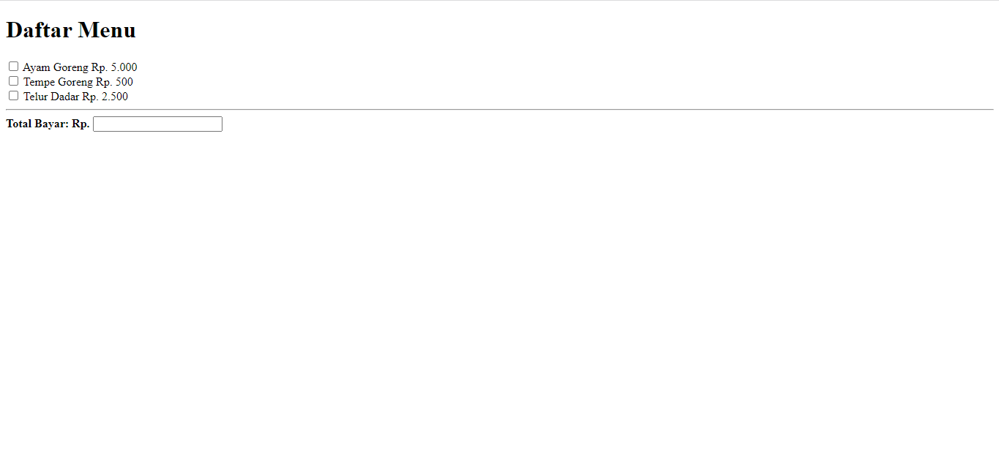

# Lab5Web

<h1 align="center">JAVASCRIPT LEARNING</h1>

## Pengantar

<p >Dalam praktikum kali ini kita akan mempelajari tentang dasar dasar pemrograman web dengan menggunakan bahasa Javascript. sebelum membahas lebih lanjut berikut beberapa hal yang harus kita ketahui tentang javascript

JavaScript adalah bahasa pemrograman yang sering digunakan untuk mengembangkan situs web interaktif. Ini adalah bahasa yang diterjemahkan dan dieksekusi di dalam web browser, memungkinkan Anda menambahkan interaktivitas, seperti validasi formulir, animasi, dan pembaruan dinamis, ke halaman web Anda. JavaScript juga sering digunakan dalam pengembangan permainan web dan aplikasi web berbasis klien.

Bahasa JavaScript memiliki sintaksis yang sederhana dan mudah dipahami, menjadikannya pilihan populer untuk pemula dalam pemrograman web. Saat ini, JavaScript memiliki beragam kerangka kerja (framework) yang kuat, seperti React, Angular, dan Vue, yang mempermudah pengembangan aplikasi web yang canggih.

JavaScript adalah salah satu komponen utama dalam pengembangan web modern, dan mempelajarinya dapat membuka pintu ke berbagai kesempatan dalam dunia pemrograman.</p>

## Implementasi Javascript

Contoh penggunaan javascript pada tag \<head>

```js
<head>
  <script type="text/JavaScript">alert("Javascript pada tag head.");</script>
</head>
```

Contoh penggunaan javascrip pada tag \<body>

```js
<body>
  <h1>Pengenalan JavaScript</h1>
  <h3>Contoh document.write</h3>
  <script>document.write("Hello World");</script>
</body>
```

Contoh Penggunaan Javasript Eksternal

```js
<head>
  <script type="text/JavaScript" src="eksternal.js"></script>
</head>
```

<hr>

<h1 align="center">PRAKTIKUM 5</h1>

<b>Instruksi Praktikum</b>

1. Persiapkan text editor misalnya VSCode.
2. Buat folder baru dengan nama lab5_javascript.
3. Ikuti langkah-langkah praktikum yang akan dijelaskan berikutnya.
4. Lakukan validasi dokumen html dengan mengakses http://validator.w3.org

## !Javasripct Learning

sebelum Lanjut apabila ingin Melihat kumpulan script dan hasilnya bisa dilihat [disini](/lab5_javascript/index.html)



## Dasar Pemrograman Javasript

### Pengenalan Javascript

**SourceCode** : [klik disini](/lab5_javascript/javascript.html)

Screenshoot :


### Pemakaian Alert

**SourceCode** : [klik disini](/lab5_javascript/alertbox.html)

Screenshoot : 

### Pemakaian method dalam objek

**SourceCode** : [klik disini](/lab5_javascript/method.html)

Screenshoot : 

### Pemakaian Prompt

**SourceCode** : [klik disini](/lab5_javascript/prompt.html)

Screenshoot : 

### Pembuatan fungsi dan cara pemanggilannya

**SourceCode** : [klik disini](/lab5_javascript/function.html)

Screenshoot : 

### Operasi dasar aritmatika

**SourceCode** : [klik disini](/lab5_javascript/aritmatika.html)

Screenshoot : 

### Seleksi kondisi (if..else)

**SourceCode** : [klik disini](/lab5_javascript/selection_condition.html)

Screenshoot : 

### Penggunaan operator switch untuk seleksi kondisi

**SourceCode** : [klik disini](/lab5_javascript/switch.html)

Screenshoot : 

## Pembuatan Form

### Form Input

**SourceCode** : [klik disini](/lab5_javascript/form_input.html)

Screenshoot : 

### Form Button

**SourceCode** : [klik disini](/lab5_javascript/form_button.html)

Screenshoot : 

## HTML DOM

### Pilihan menggunakan checkBox dengan perhitungan otomatis

**SourceCode** : [klik disini](/lab5_javascript/checkbox.html)

Screenshoot : 

<hr>

<h1 align="center">Pertanyaan dan Tugas
</h1>

Buat script untuk melakukan validasi pada isian form.

**Script** :

```js
<script>
      function validateForm() {
        var email = document.getElementById("email").value;
        var password = document.getElementById("password").value;

        var emailRegex = /^\w+([\.-]?\w+)*@\w+([\.-]?\w+)*(\.\w{2,3})+$/;
        if (!email.match(emailRegex)) {
          document.getElementById("error-message").textContent =
            "Email tidak valid.";
          return false;
        }

        if (password.length < 8) {
          document.getElementById("error-message").textContent =
            "Password harus minimal 8 karakter.";
          return false;
        }

        return true;
      }
    </script>
```

Screenshoot : 

<h1 align="center">TERIMAKASIH👍</h1>
